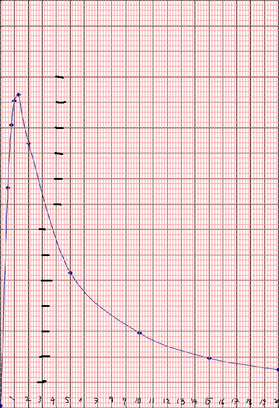

# Infrared Sensor Design Explanation
Notes regarding motherboard IR sensor design choices and specs.

## SHARP GP2Y0A51SK0F
- SHARP's shortest distance IR sensor
- pros:
  - beautiful output curve on datasheet to lean on
  - consistent readings across all sensor instances when readings are between 2-15cm
- cons:
  - slow analog output computation time of 16.5ms +/-3.7ms
  - requires 4.5V minimum supply voltage
  - a strange 0.25V to 2.5V output range
  - readings corrupted in sunlight

## Voltage Divider
- output from the SHARP sensors needs to be scaled to fit to AT32UC3L0256's 0V-1.8V scale
- 330 Ohms and 750 Ohms used to be used, but switched to 1k and 2.2k Ohm resistor networks to further reduce current

## SHARP Sensor Output Graph Extracted
- 
  - upon analyzing the datasheet's output graph and counting boxes, an equation has been generated to fit and replicate the line
    - the equation is: y = ab^x, a = 2.71272, b = 0.858585; R^2 of 0.95
    - Desmos equation of best fit: https://www.desmos.com/calculator/5e0uez3kfr
  
  - ADC reading provided 10-bit ADC on MCU and voltage divider scaling the SHARP sensor output to match the MCU's ADC scale of 0V-1.8V:
    - ADC reading = ((((2.71272)(0.858585)x) * (2.2 / (1 + 2.2) )) / 1.8V) * 1024
    - distance = Log(0.858585) ((((Reading / 1024) * 1.8) * (3.2 / 2.2)) / (2.71272))
    - Desmos equations here: https://www.desmos.com/calculator/povzmiv0ha

## Archived Ideas
- 1mm pitch 10 pin header for programming
  - requires an adapter board to go from 2.54mm JTAG to 1mm 10 pin header
  - the standard JTAG key is only available on 2.54mm, and it saves some thinking each time you program the micromouse, so archived idea