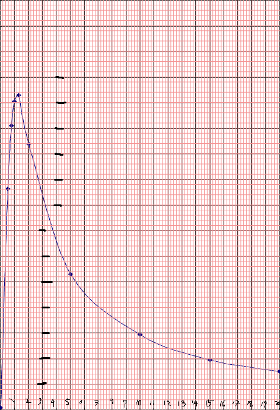

# Infrared Sensor Design Explanation

- Notes regarding motherboard IR sensor design choices and specs

## SHARP GP2Y0A51SK0F

- The GP2Y0A51SK0F sensor is SHARP's shortest distance IR sensor
- Pros:
  - Output behavior is deterministic, as defined by the output graph on datasheet
  - Each physical sensor behaves identically when readings are between 2-15cm
- Cons:
  - Slow analog output computation time of 16.5ms +/- 3.7ms
  - Requires 4.5V minimum supply voltage
  - A strange 0.25V to 2.5V output range
  - Readings are corrupted in an abundance of IR light (sunlight, etc)

## Voltage Divider

- Output from the SHARP sensors needs to be scaled to fit to the processor's ADC range (0V-1.8V for the AT32UC3L0256 MCU)
- 330 Ohms and 750 Ohms were previously used, but switched to 1k and 2.2k Ohm resistor networks to further reduce current

## SHARP Sensor Output Graph Extracted

- 
  - An equation was generated fitting/replicating the output by overlaying a grid on the output graph on SHARP's datasheet
    - Equation is: `y = ab^x, a = 2.71272, b = 0.858585, x = distance, y = output voltage; R^2 of 0.95`
    - Desmos equation of best fit: https://www.desmos.com/calculator/5e0uez3kfr
  - ADC reading provided 10-bit ADC on MCU and voltage divider scaling the SHARP sensor output to match the MCU's ADC scale of 0V-1.8V:
    - `ADC reading = ((((2.71272)(0.858585)^x) * (2.2 / (1 + 2.2) )) / 1.8V) * 1024`
    - `distance = Logbase[0.858585]((((ADC Reading / 1024) * 1.8) * (3.2 / 2.2)) / (2.71272))`
    - Desmos equations here: https://www.desmos.com/calculator/povzmiv0ha

## Archived Ideas

- Custom IR sensor
  - In the works- would be the next step if the GP2Y0A51SK0F becomes a bottleneck
