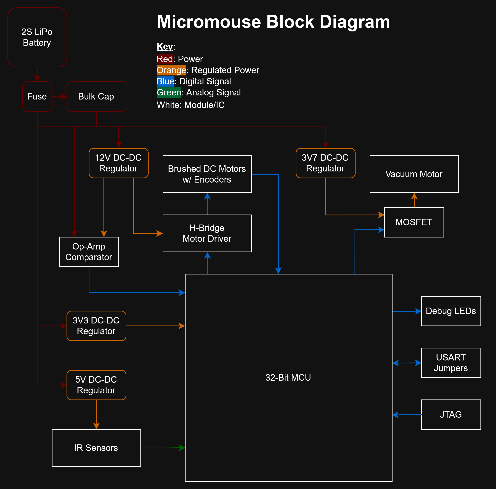

# Overview

- Micromouse motherboard overview (block diagram and key references)

## Block Diagram

- 2S LiPo Battery
  - Micromouse power supply
  - Routed to a fuse bulk capacitor
- 12V DC-DC Regulator
   - 12V buck-boost switching regulator takes 7V4 from battery and supplies power to motor driver
   - ...To be removed for motor driver to be directly supplied w/ battery power
- H-Bridge Motor Driver
  - Drives the brushed DC motors by driving the wheel gear train
  - H-bridge IC is routed to MCU IO pins to control direction and speed
- Brushed DC Motors w/ Encoders
  - JST connector to ServoCity DC motors w/ built-in magnetic encoders
  - Routed to MCU IO and interrupt pins and flyback diodes for back-EMF protection
  - Each motor is connected to a drive gear, that drives two wheels on each side of the mouse
- Op-Amp Comparator
  - An op-amp configured as a comparator to detect low battery
  - Simple battery management
- 3V7 DC-DC Regulator
  - Vacuum Power
  - Step-down switching regulator that provides 3V7 2A supply
  - Routed to vacuum motor through a MOSFET
- Vacuum Motor
  - A 3D printed impeller vacuum fan is super glued to a brushed motor to provide traction via suction
  - Driven w/ a MOSFET and an MCU's PWM pin
  - Motor connectors to PCB via PicoBlade connector
- 3V3 DC-DC Regulator
  - Step-down switching regulator that provides 3V3 0.5A supply
  - Supplies power to MCU and JTAG
- 5V Power
  - Step-down switching regulator that provides 5V 0.5A supply
  - Supplies power to IR sensors
- IR Sensors
  - SHARP 2~15cm infrared sensors
  - Output from each sensor is constrained to 0~2V5 w/ a voltage divider to scale down to MCU's ADC pin range
- Debug LEDs
  - Indicators for firmware/hardware troubleshooting
- USART Jumpers
   - USART breakout from MCU to an RS232 cable or USART bridge
- 32-Bit MCU
  - AT32UC3L0256 MCU
  - Running at 35MHz (max 50MHz), programmed via JTAG

## General References

- Bryant Gonzaga and Team's Micromouse:
  - https://github.com/gonzagab/WolfieMouse/blob/master/doc/hardware_design/schematic_2017_Feb.pdf
- Green Ye
  - Everyone refers to this micromouse design: http://greenye.net/Pages/Micromouse/Micromouse2016-2017.htm
- Decimus 4
  - https://micromouseonline.com/2012/05/16/shapeways-motor-mounts-arrive/
  - Thorough documentation
- APEC Micromice
  - Beautiful museum of mice: https://micromouseusa.com/?p=496
- Veritasium Micromouse Video
  - https://www.youtube.com/watch?v=ZMQbHMgK2rw&t=14s
- University of Munich, Micromouse Project
  - https://www.shalen.dev/downloads/micromouse-final-report.pdf
- Micromouse Article for Choosing Parts
  - https://medium.com/analytics-vidhya/mm-sensors-and-motors-7fa3a870db67
