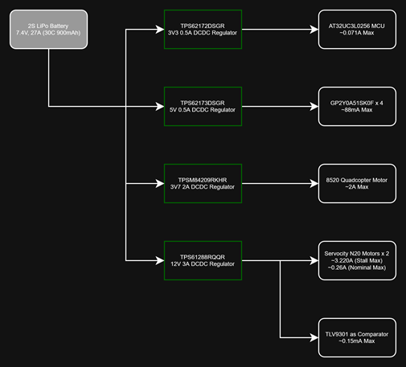
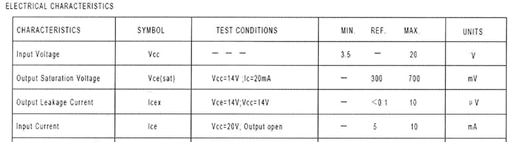
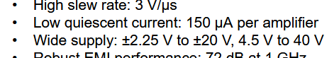
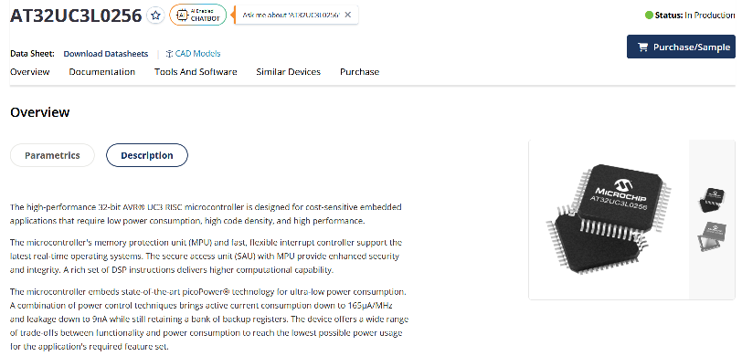
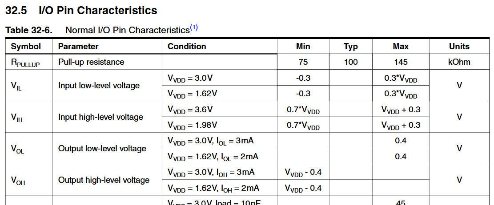
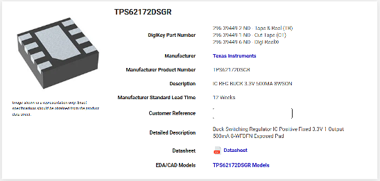
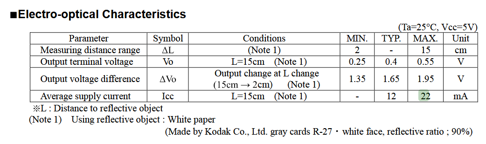
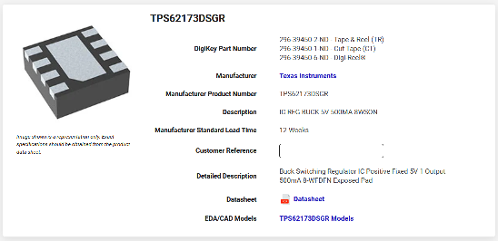

# Power Design Explanation

- TODO: create a power tree diagram using these markdown notes
- Notes regarding motherboard power design choices and specs.

## Index

- [Power Tree Diagram](#power-tree-diagram)
- [3V7 Vacuum Power](#3v7-vacuum-power)
- [12V Wheel Motor Power](#12v-wheel-motor-power)
- [3V3 Power](#3v3-power)
- [5V Power](#5v-power)
- [Switching vs Linear Regulators](#switching-vs-linear-regulators)
- [Battery Selection](#battery-selection)
- [Power Management](#power-management)
- [PCB Traces](#pcb-traces)
- [Electrical Protection](#electrical-protection)
- [Archived Ideas](#archived-ideas)

## Power Tree Diagram

- 
  - Simple/high-level power tree diagram showing battery -> regulators -> components powered

## 3V7 Vacuum Power

- ~2A is ideal for a 8520 quadcopter motor
  - Experiment done here: https://notblackmagic.com/projects/motor-test-stand/
- Regulator selection
  - TI generated circuit: https://webench.ti.com/appinfo/webench/scripts/SDP.cgi?ID=3EACC4ED5253923B
  - 3V7, 2A circuit

## 12V Wheel Motor Power

- TODO:
  - Right now we have a regulator between the 2S LiPo battery and the TB6561FG motor driver
  - ...It's better to just toss the regulator and directly hook the battery to a modern motor driver
  - Low voltage is fine- current draw is more important
  - Something like this:
    - DRV8833: https://www.digikey.com/en/products/detail/texas-instruments/DRV8833RTYR/2741823
- ServoCity's [Premium N20 Gear Motor (5:1 Ratio, 4900 RPM, with Encoder)](https://www.servocity.com/4900-rpm-micro-gear-motor-w-encoder/)
  - Demands 1.6A on stall, and 12V nominal
  - 
    - Encoders demand 10mA max
  - 1.6A * 2 + 10mA * 2 = 3.220A needed
    - ...But this is if we want to consistently support stall current
    - Nominal is much less, at 120mA per motor- there's no need to provide the full 1.6A per motor
- Comparator
  - +12V is used to power the OpAmp in comparator configuration for battery management too
  - 
  - ...Negligible current draw
- Regulator selection
  - TI generated circuit tool: https://webench.ti.com/appinfo/webench/scripts/SDP.cgi?ID=AA12043C39DD7B4B
  - 12V, 3A circuit
  - Again, we shouldn't need this, but for now this is what we use

## 3V3 Power

- 
  - Datasheet here: https://ww1.microchip.com/downloads/en/DeviceDoc/Atmel-32145-32-bit-Flash-MCU-UCL0_datasheet.pdf
  - 165uA/MHz at 50MHz is 8.25mA max current draw
- 
  - IO pins sink 3mA per pin, assuming we're using them safely w/ each device:
    - USART RX, TX
    - LED x4
    - Configuration pushbutton
    - JTAG: TDI, TCK, TDO, TMS
    - Wheel motor drive pins: 4 direction pins + 2 pwm pin, STBY, CLD
    - Vacuum MOSFET drive pin
    - Regulator enable pin
  - 21 pins * 3mA = 63mA total
- Total current:
  - 63mA + 8.25mA = 71.25mA total
- Regulator selection
  - 
  - TI's TPS62172DSGR
  - 3V3 500mA switching regulator
  - Datasheet here: [TI Link](https://www.ti.com/lit/ds/symlink/tps62171.pdf?HQS=dis-dk-null-digikeymode-dsf-pf-null-wwe&ts=1768928900773&ref_url=https%253A%252F%252Fwww.ti.com%252Fgeneral%252Fdocs%252Fsuppproductinfo.tsp%253FdistId%253D10%2526gotoUrl%253Dhttps%253A%252F%252Fwww.ti.com%252Flit%252Fgpn%252Ftps62171)

## 5V Power

- 
  - Each sensor draws 22mA max, so 4 of them makes a total of 88mA max
- Regulator selection
  - 
  - TI's TPS62173DSGR
  - 5V 500mA switching regulator
  - Datasheet here: [TI Link](https://www.ti.com/lit/ds/symlink/tps62171.pdf?HQS=dis-dk-null-digikeymode-dsf-pf-null-wwe&ts=1768928900773&ref_url=https%253A%252F%252Fwww.ti.com%252Fgeneral%252Fdocs%252Fsuppproductinfo.tsp%253FdistId%253D10%2526gotoUrl%253Dhttps%253A%252F%252Fwww.ti.com%252Flit%252Fgpn%252Ftps62171)

## Switching vs Linear Regulators

- Switching regulators are the way to go: https://www.rohm.com/electronics-basics/dc-dc-converters/linear-vs-switching-regulators
  - More details in _The Art of Electronics_ too
- Texas Instruments
  - TI provides a fantastic tool to generate power circuits: https://webench.ti.com/power-designer/switching-regulator
  - TI provides the best datasheets to begin w/ anyway even if you were to manually design a regulator circuit

## Battery Selection

- Battery type
  - LiPo is the best, as per University of Nevada: https://www.physics.unlv.edu/~bill/ecg497/Drew_Tondra_report.pdf
    - Best for performance and rechargeability
    - Smallest form factor 2S LiPo battery chosen on Amazon
    - LiPo analysis video: https://www.youtube.com/watch?v=Lk7wzVYmXSA
    - Understanding LiPo specs: https://www.rchelicopterfun.com/lipo-battery-ratings.html
- Current draw
  - Most RC car LiPo batteries are capable of providing high current
  - We need at least 6A to comfortably drive the micromouse
  - LiPo batteries' capacity multiplier tells us how much current the battery can safely discharge continuously
    - 900 mAh 30C means 27A max current draw
    - 900 mAh at 6A current draw means 9 minutes of activity
- Rocker switch
  - Many rocker switches don't provide DC current limits for such high currents- this is because arching is common for high DC current
  - We should be using a small switch to drive a MOSFET/BJT instead
  - We're going for a switch that safely operates w/ 15A AC for now

```
Total current dischargeable calculation:
900 mAh, 30C rating
900 mA * 30 = 27A dischargeable continuously

Micromouse active time calculation:
900 mAh, 6A draw max
0.9Ah / 6A = 9 minutes
```

## Power Management

- Enable signal
  - Every switching regulator, except the 3V3 regulator, has an enable signal that can be toggled by the MCU
- Op-Amp in comparator configuration
  - Minimal circuit w/ 1 IC and resistors
  - Takes input battery voltage, and compares it to desired low battery voltage
  - Output result of comparator must be scaled to match MCU high/low logic
    - Voltage divider calculator: https://ohmslawcalculator.com/voltage-divider-calculator
  - 3.74k Ohm resistor chosen for R2 to get 3.2V max from comparator output
  - 2S LiPo batteries are considered low battery when they reach 6.4V-6.6V, so low voltage of 6.5V chosen
  - 100k and 118k resistors chosen for R1 and R2 to get 6.49V on 2nd comparator input

```
Voltage divider for 2nd low battery compare signal
12V input, 100k for R1 (from example schematic on op-amp datasheet), 6.5V output
R2 = 118k

Voltage divider for result signal:
12V input, 10k for R1 (arbitrarily recycled resistor), 3.3V output
Vout = Vin * (R2 / (R2 + R1))
R2 = 3.793k
```

## PCB Traces

- Even if your regulator circuit can provide 5A, 35 mil traces can only carry 3A
- Use Saturn PCB Design tool to ensure that traces are wide enough to carry the desired current

## Electrical Protection

- Battery to regulator input diode
  - IEEE Berkely mentions they encountered an issue w/ current flowing from MCU to regulator: https://ieee.berkeley.edu/micromouse-lab-5/
  - Added to prevent reverse current from regulator to battery
  - 1V voltage drop, 6A standard rectifier between battery and all switching regulators
- Multi-Stage decoupling
  - Varying capacitors of differing capacitance to absorb noise and suppress spikes
  - Low capacitance -> high frequency spikes
  - High capacitance -> low frequency bulk decoupling
- Flyback diodes
  - Why we need these
    - Inductors store energy in a magnetic field while current flows
    - Turning off a motor causes the motor's magnetic field to collapse
    - Inductors resist changes in current, and try to keep current flowing- this causes high voltage spike in the reverse direction across the inductor
    - To safely dissipate excess power, there needs to be a diode that breaks down in response to such spikes
  - Diode selection
    - Breakdown voltage of 2-3 times normal voltage is good
    - Schottky diodes are good for
      - Low forward drop
      - Less heating
      - Faster recovery time if switching is fast
- Order of connecting components to ground
  - Electronics stack exchange thread: https://electronics.stackexchange.com/questions/458538/feeding-microcontroller-and-linear-actuators-motors-with-the-same-power-supply
  - Noisy components should be as close as possible to the power supply ground to mitigate ground loops and noise
- Fuse
  - 10A fuse for entire mouse, provided a rough 6A consumption max
  - 125% of circuit's normal operating current is good rule of thumb
- Bulk capacitor
  - 1.2mF 16V bulk capacitor for entire mouse
  - Good rule of thumb is:
    - 100uF per A of max load current for general cases
    - 200~470uF per A for high-power and noisier circuits

## Archived Ideas

- Full-on BMS circuit
  - Would be cool to get battery SOH and SOC w/ coulomb counting IC, but requires more hardware and involved schemes
  - Archived due to complexity
- Current & voltage monitoring
  - Requires more pins from MCU and extra hardware (shunt resistors, sensing IC's)
  - Archived for now until crucial features are complete
